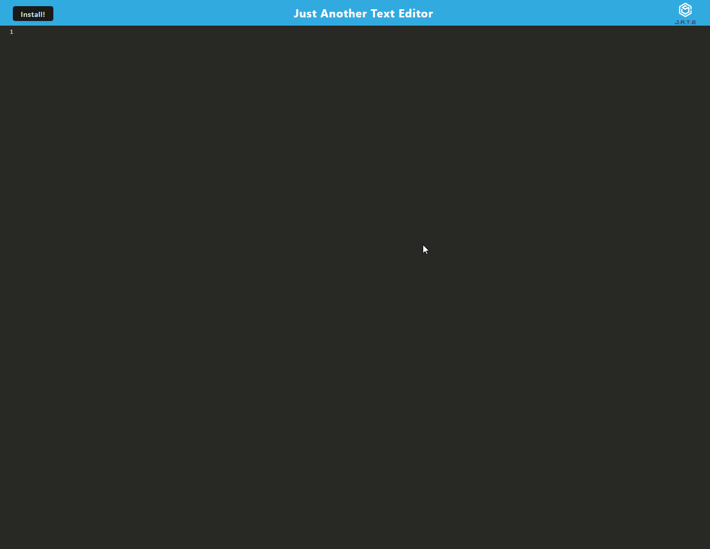

# J.A.T.E

## Screenshot

## Description

JATE is "Just Another Text Editor" which allows user the 'write code' in an online text editor styled to JavaScript which allows users to write code which is stored locally on IndexedDB, JATE is also a Progressive Web App, which allows the user to download the application to run locally on their device. Caching stores the webapp so it runs even without an internet connection!

This is my first PWA and working with the associated webpacks. It was more a struggle than I initially expected, ensuring that all the correct configs are working etc. Was a challenge to debug but it was accomplished.

While the base application was created already, getting it involved with IndexedDB was also a small struggle just due to how webpacking words and solving the errors when everything is bundled. 

I have learned a great deal about the webpack packages and the creating of your own social worker.

## Table of Contents

- [Installation](#installation)
- [Usage](#usage)
- [Credits](#credits)
- [License](#license)

## Installation

N/A

## Usage

The deployed application is live on Heroku and can be found here [here](https://jate-stockwell-7721e06c8676.herokuapp.com/)

## License

Infomation on the Unlince can be found [here](https://unlicense.org/)

## Credits

[Webpack](https://webpack.js.org/)

[Workbox Google DOCS](https://developers.google.com/web/tools/workbox/reference-docs)

[IndexedDB API](https://developer.mozilla.org/en-US/docs/Web/API/IndexedDB_API)